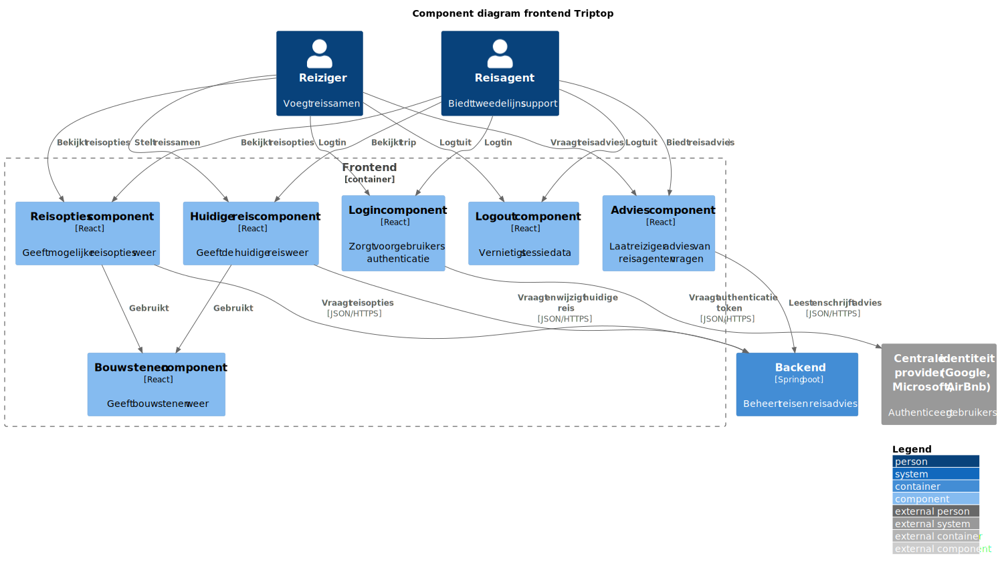
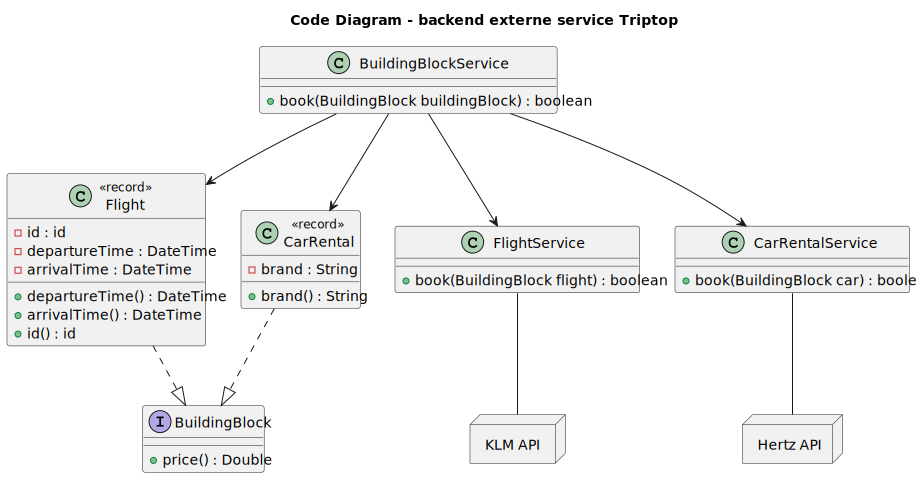
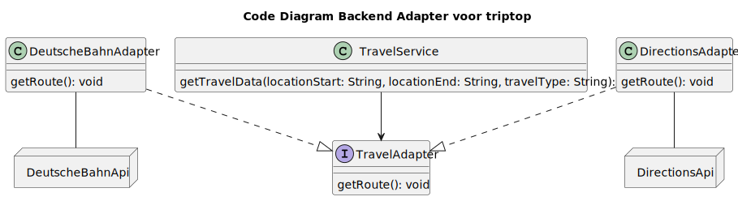
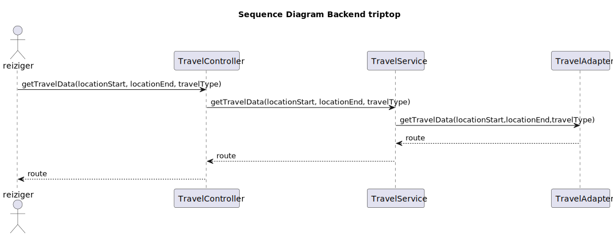

# Software Guidebook Triptop

## 1. Introduction
Dit software guidebook geeft een overzicht van de Triptop-applicatie. Het bevat een samenvatting van het volgende: 
1. De vereisten, beperkingen en principes. 
1. De software-architectuur, met inbegrip van de technologiekeuzes op hoog niveau en de structuur van de software. 
1. De ontwerp- en codebeslissingen die zijn genomen om de software te realiseren.
1. De architectuur van de infrastructuur en hoe de software kan worden geinstalleerd. 

## 2. Context

Triptop wil een applicatie geïnspireerd op [Ellipsis Travel](https://www.ellipsistravel.com/) voor de Nederlandse markt ontwikkelen. Met de webapplicatie kan een reiziger zelf zijn reis samenstellen. De reiziger koppelt verschillende bouwstenen aan elkaar en vormt daarmee zijn eigen reis. Een reisagent zal de rol van tweedelijns support vervullen. Deze tweedelijns support biedt advies wanneer een reiziger er zelf niet uitkomt of wanneer hij/zij/hun zijn uiteindelijke reisplan wil bespreken. Reiziger stellen tegenwoordig steeds meer zelf hun reis samen. Hieronder staat een context diagram voor triptop.

## 3. Functional Overview

Om de belangrijkste features toe te lichten zijn er user stories en twee domain stories gemaakt en een overzicht van het domein in de vorm van een domeinmodel. Op deze plek staat typisch een user story map maar die ontbreekt in dit voorbeeld.

### 3.1 User Stories

#### 3.1.1 User Story 1: Reis plannen

Als gebruiker wil ik een zelfstandig op basis van diverse variabelen (bouwstenen) een reis kunnen plannen op basis van mijn reisvoorkeuren (wel/niet duurzaam reizen, budget/prijsklasse, 's nachts reizen of overdag etc.) zodat ik op vakantie kan gaan zonder dat hiervoor een reisbureau benodigd is.

#### 3.1.2 User Story 2: Reis boeken

Als gebruiker wil ik een geplande reis als geheel of per variabele (bouwsteen) boeken en betalen zodat ik op vakantie kan gaan zonder dat hiervoor een reisbureau benodigd is.

#### 3.1.3 User Story 3: Reis cancelen

Als gebruiker wil ik een geboekte reis, of delen daarvan, kunnen annuleren zodat ik mijn geld terug kan krijgen zonder inmenging van een intermediair zoals een reisbureau.

#### 3.1.4 User Story 4: Reisstatus bewaren 

Als gebruiker wil ik mijn reisstatus kunnen bewaren zonder dat ik een extra account hoef aan te maken zodat ik mijn reis kan volgen zonder dat ik daarvoor extra handelingen moet verrichten.

#### 3.1.5 User Story 5: Bouwstenen flexibel uitbreiden

Als gebruiker wil ik de bouwstenen van mijn reis flexibel kunnen uitbreiden met een zelf te managen stap (bijv. met providers die niet standaard worden aangeboden zoals een andere reisorganisatie, hotelketen etc.) zodat ik mijn reis helemaal kan aanpassen aan mijn wensen.

### 3.2 Domain Story Reis Boeken (AS IS)

### 3.3 Domain Story Reis Boeken (TO BE)

### 3.4 Domain Model

## 4. Quality Attributes

Voordat deze casusomschrijving tot stand kwam, heeft de opdrachtgever de volgende ISO 25010 kwaliteitsattributen benoemd als belangrijk:
* Compatibility -> Interoperability (Degree to which a system, product or component can exchange information with other products and mutually use the information that has been exchanged)
* Reliability -> Fault Tolerance (Degree to which a system or component operates as intended despite the presence of hardware or software faults)
* Maintainability -> Modularity (Degree to which a system or computer program is composed of discrete components such that a change to one component has minimal impact on other components)
* Maintainability -> Modifiability (Degree to which a product or system can be effectively and efficiently modified without introducing defects or degrading existing product quality)
* Security -> Integrity (Degree to which a system, product or component ensures that the state of its system and data are protected from unauthorized modification or deletion either by malicious action or computer error)
* Security -> Confidentiality (Degree to which a system, product or component ensures that data are accessible only to those authorized to have access)

## 5. Constraints

* Deployment platform:
  * Browser
  * Server
* Formaat voor communicatie met externe API's: JSON
* Communicatie met externe API's: HTTPS

## 6. Principles

* Dependency injection
* DRY (don't repeat yourself), we geven voorkeur aan weinig dubbele code
* Don't reinvent the wheel, we geven voorkeur aan het gebruik van design patterns wanneer mogelijk

## 7. Software Architecture

###     7.1. Containers

Deze paragraaf bevat een statische containerdiagram van de gehele Triptop webapplicatie en dynamische containerdiagrammen van de drie belangrijkste scenario's.

Hieronder staat het statische containerdiagram van de Triptop webapplicatie. Om dit diagram overzichtelijk te houden is ervoor gekozen geen returnlijnen toe te voegen wanneer er iets wordt opgevraagd. Verder hebben wij de keuze gemaakt de overige providers te bundelen aangezien ze allemaal dezelfde relatie met de backend hebben. Daarnaast hebben wij gekozen voor drie relaties tussen de reiziger en de frontend, zodat de belangrijke acties explicitiet worden weergeven. Aangezien inloggen geen doel op zichzelf is is deze buiten beschouwing gelaten.

Hieronder staat het dynamische containerdiagram van het inloggen. Aangezien de backend pas een token verifieerd bij latere acties, en niet bij het inloggen zelf, is dit geen onderdeel van dit diagram.

Hieronder staat het dynamische containerdiagram van het kiezen van een reisoptie. Wij hebben gekozen de reisopties niet in de backend te cachen, omdat er dan reisopties die niet meer beschikbaar zijn kunnen worden weergegeven.

Hieronder staat het dynamische containerdiagram voor het boeken van een reis. Wij hebben de keuze gemaakt om initieel te praten over het boeken van een reis en later over een reisplan, aangezien het reisplan pas bekend is als deze is opgehaald uit de database.

###     7.2. Components

> [!IMPORTANT]
> Voeg toe: Component Diagram plus een Dynamic Diagram van een aantal scenario's inclusief begeleidende tekst.

Deze paragraaf bevat twee componentdiagrammen van de frontend en backend.

Hieronder staat het componentdiagram van de frontend. Wij hebben gekozen voor een bouwstenencomponent enkel voor visuele weergave, waardoor een duidelijke scheiding tussen de huidige reis en reisopties kan worden weergegeven.

Hieronder staat het componentdiagram van de backend. We hebben gekozen direct de controllers met de authenticatie service te verbinden, zodat iemands authenticatie zo snel mogelijk wordt geverifieerd.

###     7.3. Design & Code

Ontwerpvraag: Hoe zorg je ervoor dat je makkelijk een nieuwe externe service kan toevoegen?

Hieronder staat het klassendiagram en het sequence diagram voor deze ontwerpvraag. In deze opzet was er geëxperimenteerd met een facade. In dit klassendiagram en sequence diagram is zichtbaar dat een facade niet de complexiteit verminderd, maar juist iets verhoogt. Een controller kan namelijk prima direct `FlightService` en `CarRentalService` aanroepen. De `BuildingBlockService` is dus onnodig en voegt complexiteit toe. Vandaar dat dit niet is toegepast in het prototype.

Ontwerpvraag: Hoe kunnen we verschillende externe vervoersservices integreren zonder afhankelijk te worden van hun specifieke implementaties?

Hieronder staat het klassendiagram en het sequence diagram voor deze ontwerpvraag. In deze opzet is een adapter pattern geïmplementeerd.

Ontwerpvraag: Hoe ondersteun ik meerdere advies types?

Hieronder staat het klassendiagram en het sequence diagram voor deze ontwerpvraag. In deze opzet is een strategy pattern geïmplementeerd. Bij een `AdviceStrategy` is gekozen om de accomodations samen te voegen in een array en deze array terug te sturen.

## 8. Architectural Decision Records

### 8.1. ADR-001 Database

Date: 2025-03-21

## Status

Accepted

## Context

We need a database for the Triptop planning application. We expect it to handle 10.000 queries per minute.

## Decision

| Database           | Redis (on disk) | Microsoft SQL Server | Neo4J |
|--------------------|----------------|----------------------|------|
| Scalability        | +              | 0                    | +    |
| Learnability       | 0              | ++                   | 0    |
| Performance        | +              | ++                   | 0    |
| Price              | +              | --                   | -    |
| Communitiy Support | 0              | ++                   | 0    |

We decided on Microsoft SQL Server. We took into account that the development team has preexisting knowledge of Microsoft SQL Server, thus saving a significant amount of work by choosing it, which makes it very attractive as the development is under tight time constraints.

## Consequences

We must use the 'Microsoft SQL Server' SQL language.
Integration with other Microsoft technologies and tools will be simplified.

### 8.2. ADR-002 Building block pattern

Date: 2025-03-28

## Status

Accepted

## Context

We are looking into a structural software engineering pattern for managing building blocks in the backend. Every building block is slightly different and has a different use case. We need something that caters to each building block's needs. It should be in line with our principles, be flexible and contain little duplicate code. The backend also needs to communicate data from building blocks to external api's.

## Decision

We decided to try the Facade design pattern, mainly because it keeps the code flexible and allows us to add new APIs without breaking existing code. We also considered the Adapter design pattern, but the refactoring.guru site points out that the design pattern Adapter is better suited if we had one building block instead of multiple.

However, we decided to not use the Facade design pattern. The prototypes, a class diagram, a sequence diagram and small java application, clearly showed no decrease in complexity by applying the pattern. It actually slightly increased complexity.

Due to time constraints the only other alternative is no pattern. Thus we have decided to use no pattern.

## Consequences

Code without a pattern could be suboptimal and might not be as easy to understand

### 8.3. ADR-003 Design pattern advice

Date: 2025-03-28

## Status

Accepted

## Context

We need to choose a design pattern on how we will implement the delegation of advice strategies. Advice is given to the traveler based upon data received by the api.

## Alternative

An alternative is not implementing any pattern.

## Decision

We decided to implement the design pattern strategy. This will allow us to easily switch between the different building blocks. 
We also made a testing application and that proved that this strategy would be a viable option and according to refactoring.guru this pattern is preferential for this use case. 
As said in the chapter 6 principles we prefer methods that don't reinvent the wheel, thus another to choose this pattern over no pattern.

## Consequences

There are multiple strategies that have one superclass that can be used to call advice from all the children.

### 8.4. ADR-004 Design pattern transport

Date: 2025-03-27

## Status

Accepted

## Context

We need to choose a design pattern based on the following question: "Hoe kunnen we verschillende externe vervoersservices (zoals Google Maps of een veerdienst API) integreren zonder afhankelijk te worden van hun specifieke implementaties"

## Alternatives

We considered the factory pattern and the adapter pattern. These are alternatives, because they are both structral patterns according to refactoring.guru.

## Decision

We decided to use the adapter pattern. The adapter pattern will allow us to create a concistent interface for interacting with various external services while maintaining flexibility and so reducing direct dependencies. This pattern is highly recommended for this use case according to refectoring.guru. We also made a small application to test the adapter pattern and that proved that this pattern would be a good option to implement. 

## Consequences

We need to introduce an interface that defines the methods required for fetching the data.

### 8.5. ADR-005 Building block pattern

Date: 2025-04-03

## Status

Accepted

## Context

We are looking into a structural software engineering pattern for managing building blocks in the backend. Every building block is slightly different and has a different use case. We need something that caters to each building block's needs. It should be in line with our principles, be flexible and contain little duplicate code. The backend also needs to communicate data from building blocks to external api's.

As mentioned in ADR-002, we decided to not implement 

## Decision

We decided to try the Facade design pattern, mainly because it keeps the code flexible and allows us to add new APIs without breaking existing code. We also considered the Adapter design pattern, but the refactoring.guru site points out that the design pattern Adapter is better suited if we had one building block instead of multiple.

However, we decided to not use the Facade design pattern. The prototypes, a class diagram, a sequence diagram and small java application, clearly showed no decrease in complexity by applying the pattern. It actually slightly increased complexity.

Due to time constraints the only other alternative is no pattern. Thus we have decided to use no pattern.

We decided to use facade

## Consequences

Code without a pattern could be suboptimal and might not be as easy to understand

## 9. Deployment, Operation and Support

> [!TIP]
> Zelf beschrijven van wat je moet doen om de software te installeren en te kunnen runnen.